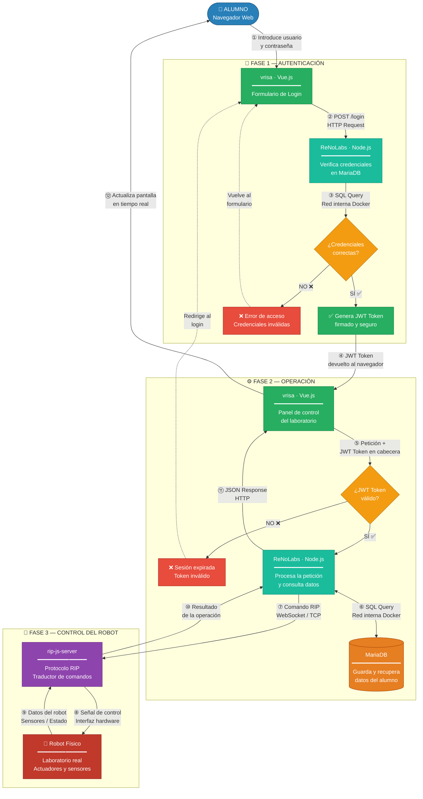

# Arquitectura de Microservicios — Robot Universitario

Documento técnico que describe la arquitectura del sistema y el flujo completo de comunicación entre cada microservicio del proyecto **Robot Universitario**.

---

## Flujo de Trabajo Completo

El diagrama muestra las tres fases del sistema: autenticación del alumno, operación desde el panel de control y control físico del robot.



---

## Resumen de Fases

| Fase | Qué ocurre | Servicios implicados |
|------|-----------|----------------------|
| **① Autenticación** | El alumno introduce sus credenciales. ReNoLabs las verifica en MariaDB. Si son correctas devuelve un JWT Token. | vrisa → ReNoLabs → MariaDB |
| **② Operación** | El alumno usa el panel de control. Cada petición lleva el JWT Token. ReNoLabs lo verifica, consulta la base de datos y procesa la acción. | vrisa → ReNoLabs ↔ MariaDB |
| **③ Control del robot** | ReNoLabs envía comandos al robot mediante el protocolo RIP. El robot ejecuta la acción y devuelve los datos al alumno. | ReNoLabs → rip-js-server → Robot |

---

## Descripción de cada Microservicio

| Servicio | Tecnología | Rol en el sistema |
|----------|-----------|-------------------|
| **vrisa** | Vue.js | Interfaz visual del alumno. Muestra el panel de control, envía peticiones al backend y actualiza la pantalla con los resultados en tiempo real. |
| **ReNoLabs** | Node.js + Express.js + PM2 | Núcleo del sistema. Expone la API REST, valida el JWT Token en cada petición, consulta MariaDB y envía comandos al robot. PM2 lo mantiene siempre activo. |
| **MariaDB** | MariaDB | Almacena usuarios, sesiones, resultados de pruebas y configuraciones del laboratorio. Solo accesible desde la red interna de Docker. |
| **rip-js-server** | JavaScript · Protocolo RIP | Capa de comunicación entre el backend y el robot. Traduce los comandos de software a señales que el hardware puede interpretar. |
| **Robot Físico** | Hardware | Laboratorio real. Ejecuta las acciones físicas y devuelve datos de sensores y actuadores al sistema. |

---

## Protocolos de Comunicación

| Tramo | Protocolo | Datos transmitidos |
|-------|----------|--------------------|
| Alumno → vrisa | HTTP / HTTPS | Credenciales, acciones del usuario |
| vrisa → ReNoLabs | REST + JWT | JSON con datos de la petición |
| ReNoLabs ↔ MariaDB | SQL | Consultas y resultados de base de datos |
| ReNoLabs → rip-js-server | WebSocket / TCP · RIP | Comandos de control del robot |
| rip-js-server → Robot | Interfaz hardware · RIP | Señales físicas de control y lectura de sensores |

---

## Aislamiento con Docker

Cada microservicio corre en su propio contenedor Docker, aislado del resto. Todos comparten la misma red interna virtual, por lo que se comunican entre sí sin exponer puertos innecesarios al exterior.

```
┌──────────────────────────────────────────────────┐
│                  RED DOCKER INTERNA              │
│                                                  │
│   ┌───────────┐        ┌────────────────────┐   │
│   │   vrisa   │ ──────►│     ReNoLabs       │   │
│   │  Vue.js   │◄─────  │  Node.js + PM2     │   │
│   │  :80      │        │  :3000             │   │
│   └───────────┘        └────────┬───────────┘   │
│                                 │                │
│                    ┌────────────▼───────────┐    │
│                    │       MariaDB          │    │
│                    │   Base de Datos        │    │
│                    │   :3306 (interno)      │    │
│                    └────────────────────────┘    │
│                                                  │
└──────────────────────────────────────────────────┘
         │ rip-js-server · Protocolo RIP
         ▼
   🤖 Robot Físico
```

> El profesor puede levantar todo el entorno con un único comando: `docker-compose up --build`

---

*Actualizar este documento ante cualquier cambio en la arquitectura del sistema.*
